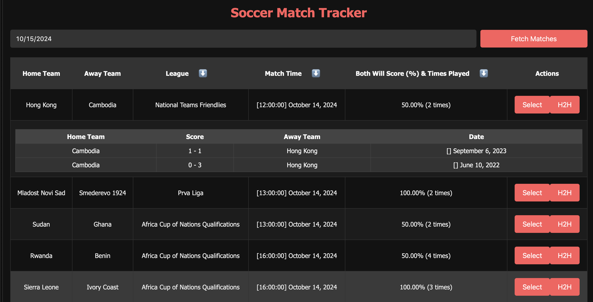

# Soccer Match Tracker

An interactive soccer match tracking application designed to fetch live match data, display head-to-head results, and show matches where both teams scored. This app allows users to search for matches on a specific date, analyze statistics, and view team performances based on historical data. The match data is fetched from the LiveScore API and includes recent team statistics and head-to-head comparisons.

## Table of Contents

- [Overview](#overview)
- [Features](#features)
- [Technologies Used](#technologies-used)
- [Concepts Covered](#concepts-covered)
- [Learning Objectives](#learning-objectives)
- [Future Improvements](#future-improvements)
- [Summary](#summary)

[Demo](https://brockaltug.github.io/soccer-predictions/)

## Overview

Soccer Match Tracker is a web-based application designed to help users follow soccer matches with detailed data, such as head-to-head results and match statistics. Users can input a date, fetch match data, and view which teams are likely to score based on previous head-to-head games. The app is optimized to display matches where both teams scored, providing a user-friendly experience for analyzing game outcomes.

## Features

- **Date-Based Match Search**: Users can input a specific date to fetch soccer matches scheduled for that day.
- **Head-to-Head Analysis**: View past results between two teams, focusing on games where both teams scored.
- **Match Time and Details**: The app displays match times, leagues, and teams involved in the selected games.
- **Responsive Design**: A clean and responsive interface that works on both desktop and mobile devices.
- **Sorted Match Data**: Users can sort matches by league, time, or head-to-head results to get the most relevant data.

## Technologies Used

- **JavaScript**: Handles dynamic content generation, API requests, and data filtering.
- **HTML5/CSS3**: Provides structure and styling for the match tracker interface.
- **LiveScore API**: Supplies real-time soccer match data, including head-to-head statistics.
- **LocalStorage**: Allows persistent storage of user selections for continued access to match data across sessions.

## Concepts Covered

- **API Integration**: Fetching match data from the LiveScore API and dynamically displaying results on the page.
- **Head-to-Head Analysis**: Using historical data to filter matches where both teams scored, enhancing data accuracy.
- **JavaScript DOM Manipulation**: Dynamically updating and creating elements in response to user searches.
- **Responsive Design**: Ensuring the application is user-friendly on various screen sizes, from mobile devices to desktops.
- **Error Handling**: Providing user feedback in cases of invalid input or missing match data.

## Learning Objectives

1. Learn how to fetch live data from an external API and display it dynamically using JavaScript.
2. Understand how to filter and process data to meet specific criteria (e.g., matches where both teams scored).
3. Explore how to manage and persist data using `localStorage` for user history.
4. Build a responsive web interface optimized for both desktop and mobile users.
5. Practice implementing features like sorting and filtering within a dynamic web application.

## Future Improvements

- **Match Notifications**: Provide live notifications when match events occur, such as goals or cards.
- **User Profiles**: Allow users to create profiles and save favorite teams for quicker access to match data.
- **Enhanced Statistics**: Include more detailed statistics, such as possession, shots on goal, and player performance data.

## Summary

Soccer Match Tracker is a web application that provides users with an easy way to track live soccer matches and analyze head-to-head statistics between teams. With data sourced from the LiveScore API, the app ensures accurate and real-time match information. The app highlights matches where both teams scored, making it a valuable tool for fans and analysts alike. This dynamic soccer tracker is built with modern web technologies, offering a clean and responsive interface for soccer enthusiasts.
